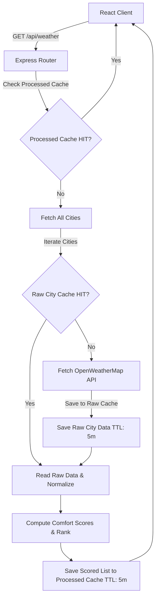

# Weather Hub — Full-Stack Weather Analytics Dashboard

A secure, full-stack weather analytics application that fetches real-time weather data for multiple global cities, processes the data on the server side using a custom **Comfort Index Score**, ranks cities from most to least comfortable, and visualizes them in a dashboard. Access is protected by **Auth0** with Email Multi-Factor Authentication (MFA) and restricted public registration.

---

## 📖 Table of Contents

1. [Tech Stack](#tech-stack)
2. [Quick Start & Setup](#quick-start--setup)
   - [Prerequisites](#prerequisites)
   - [Backend (Server) Setup](#backend-server-setup)
   - [Frontend (Client) Setup](#frontend-client-setup)
3. [Comfort Index Scoring Algorithm](#comfort-index-scoring-algorithm)
   - [Mathematical Formula](#mathematical-formula)
   - [Trapezoidal Normalization](#trapezoidal-normalization)
   - [Parameter Weighting & Justification](#parameter-weighting--justification)
4. [Server-Side Caching Architecture](#server-side-caching-architecture)
   - [Double-Layered Caching](#double-layered-caching)
   - [Cache Status Debugging](#cache-status-debugging)
5. [Authentication & Authorization (Auth0)](#authentication--authorization-auth0)
6. [Architectural Trade-Offs](#architectural-trade-offs)
7. [Live 5–7 Minute Recording Demo Prep](#live-57-minute-recording-demo-prep)
8. [Known Limitations](#known-limitations)

---

## 🛠️ Tech Stack

### Backend (Server)

- **Runtime:** Node.js + TypeScript
- **Framework:** Express.js
- **Authentication/Security:** `express-oauth2-jwt-bearer` (JWT validation) + CORS
- **Caching:** `node-cache` (in-memory, server-side caching)
- **HTTP Client:** Axios (fetching weather from OpenWeatherMap)

### Frontend (Client)

- **Framework:** React + Vite + TypeScript
- **State & Data Fetching:** Custom React hooks (`useWeatherData`) + Fetch API
- **Authentication SDK:** `@auth0/auth0-react` (Universal Login, MFA, Token Management)
- **Styling:** Premium Vanilla CSS (custom design tokens, glassmorphism, responsive grid)

---

## ⚡ Quick Start & Setup

### Prerequisites

- [Node.js](https://nodejs.org/) (v18 or higher recommended)
- An [OpenWeatherMap API Key](https://openweathermap.org/api)
- An [Auth0 Account](https://auth0.com/) with a Single Page Web App Client and an API registration.

---

### Backend (Server) Setup

1. **Navigate to the server folder:**

   ```bash
   cd server
   ```

2. **Install dependencies:**

   ```bash
   npm install
   ```

3. **Configure Environment Variables:**
   Copy the template environment file:

   ```bash
   cp .env.example .env
   ```

   Open the `.env` file and fill in your keys:

   ```env
   PORT=3000
   OPENWEATHER_API_KEY=your_openweathermap_api_key_here
   AUTH0_ISSUER_BASE_URL=https://your-tenant-name.auth0.com/
   AUTH0_AUDIENCE=https://your-api-identifier
   CLIENT_ORIGIN=http://localhost:5173
   ```

4. **Run the Development Server:**

   ```bash
   npm run dev
   ```

   The backend server will run on [http://localhost:3000](http://localhost:3000).

5. **Verify Backend Status (Public Endpoints):**
   - Health Check: [http://localhost:3000/health](http://localhost:3000/health)
   - Cache Status: [http://localhost:3000/api/cache-status](http://localhost:3000/api/cache-status)

---

### Frontend (Client) Setup

1. **Navigate to the client folder:**

   ```bash
   cd ../client
   ```

2. **Install dependencies:**

   ```bash
   npm install
   ```

3. **Configure Environment Variables:**
   Copy the template environment file:

   ```bash
   cp .env.example .env
   ```

   Open the `.env` file and fill in your Auth0 credentials:

   ```env
   VITE_AUTH0_DOMAIN=your-tenant-name.auth0.com
   VITE_AUTH0_CLIENT_ID=your_auth0_client_id
   VITE_AUTH0_AUDIENCE=https://your-api-identifier
   VITE_API_URL=http://localhost:3000
   ```

4. **Run the Development Client:**
   ```bash
   npm run dev
   ```
   The client application will run on [http://localhost:5173](http://localhost:5173).

---

## 🧮 Comfort Index Scoring Algorithm

To rate how pleasant a city's current weather feels, the backend implements a clean, decoupled, and modular Comfort Index Scoring algorithm in [comfortScore.ts](file:///d:/GitHub/weather_hub/server/src/services/comfortScore.ts).

### Mathematical Formula

The Comfort Index score is calculated as a **weighted average** of multiple normalized sub-scores, scaled to a range of `0` to `100`:

$$\text{Comfort Score} = \left( \frac{\sum_{i=1}^{N} (W_i \times S_i)}{\sum_{i=1}^{N} W_i} \right) \times 100$$

Where:

- $W_i$ is the custom weight assigned to weather parameter $i$.
- $S_i$ is the normalized comfort sub-score of weather parameter $i$ (ranging from `0.0` to `1.0`).
- $N$ is the total number of weather parameters currently evaluated.

By dividing the sum of weighted scores by the sum of all weights ($\sum W_i$), the algorithm is **completely self-balancing**. You can add new parameters with any arbitrary weight without needing to adjust the existing weights to total 100.

---

### Trapezoidal Normalization

Simply grading weather parameters linearly is mathematically flawed. For instance, both extreme cold (e.g., $-10^\circ\text{C}$) and extreme heat (e.g., $40^\circ\text{C}$) are uncomfortable, while a middle range (e.g., $18^\circ\text{C}$ to $24^\circ\text{C}$) is optimal.

To model this, we use a **trapezoidal membership function** (commonly used in fuzzy logic systems):

```
       Comfort Score (S_i)
        ^
    1.0 |      +---------+ (Comfortable Ideal Band)
        |     /           \
        |    /             \
        |   /               \
    0.0 +--+-----------------+----> Input Value (V_i)
        absMin  idealMin  idealMax  absMax
```

- **Ideal Comfort (Score = 1.0):** If the input value is within the `[idealMin, idealMax]` band, it returns `1.0`.
- **Complete Discomfort (Score = 0.0):** If the input value is outside `[absoluteMin, absoluteMax]`, it returns `0.0`.
- **Linear Transition (Slanted ramps):**
  - When $V_i$ rises from $absoluteMin$ to $idealMin$, the score scales linearly from `0.0` to `1.0`.
  - When $V_i$ falls from $idealMax$ to $absoluteMax$, the score scales linearly from `1.0` to `0.0`.

---

### Parameter Weighting & Justification

Currently, five key parameters are processed on the backend, weighted by their influence on human thermal comfort:

| Parameter             | Weight |               Ideal Range                |              Absolute Bounds              | Justification                                                                                                                                                                                            |
| :-------------------- | :----: | :--------------------------------------: | :---------------------------------------: | :------------------------------------------------------------------------------------------------------------------------------------------------------------------------------------------------------- |
| **Temperature** ($T$) | **35** | $18^\circ\text{C}$ to $24^\circ\text{C}$ | $-10^\circ\text{C}$ to $42^\circ\text{C}$ | The dominant factor in human thermo-comfort. Extreme temperature makes outdoor environments immediately uninhabitable.                                                                                   |
| **Humidity** ($H$)    | **30** |             $40\%$ to $60\%$             |             $0\%$ to $100\%$              | High humidity restricts sweat evaporation, worsening heat sensation. Low humidity causes dry skin/eyes.                                                                                                  |
| **Wind Speed** ($W$)  | **20** |        $1.0$ to $5.0\text{ m/s}$         |        $0.0$ to $20.0\text{ m/s}$         | Gentle breezes aid cooling, but absolute stagnation or gale-force winds ($>20\text{ m/s}$) are unpleasant.                                                                                               |
| **Cloudiness** ($C$)  | **15** |             $10\%$ to $50\%$             |             $0\%$ to $100\%$              | Scattered clouds offer solar protection without casting a gloomy overcast. Extreme glare or complete overcast is less comfortable.                                                                       |
| **Visibility** ($V$)  | **10** |       $8,000$ to $10,000\text{m}$        |          $0$ to $11,000\text{m}$          | High visibility ensures clarity, safety, and outdoor aesthetic value. Fog/mist reduces outdoor comfort. (API response limit to 10,000 for visisbility, so add 11,000 as the upper bound for consistency) |

---

## 💾 Server-Side Caching Architecture

Caching is implemented on the server side using the lightweight in-memory `node-cache` library.

### Double-Layered Caching

To minimize API requests (respecting OpenWeatherMap's free tier limits) and deliver fast responses to frontend clients, the application employs a two-tier cache structure:



1. **Processed Cache (`processedCache`):**
   - **Scope:** Stores the completed, computed, sorted, and ranked list of all 10 cities.
   - **Key:** `ranked_weather`
   - **TTL:** 5 minutes (`300` seconds).
   - **Benefit:** Bypasses all processing, sorting, and fetching entirely when multiple users load the dashboard simultaneously.

2. **Raw Cache (`rawCache`):**
   - **Scope:** Stores the raw OpenWeatherMap API response for each individual city.
   - **Key:** `raw:<cityId>`
   - **TTL:** 5 minutes (`300` seconds).
   - **Benefit:** If the overall `processedCache` is invalidated or cleared, subsequent requests can still build comfort scores using cached API data instead of calling the external OpenWeatherMap API.

---

### Cache Status Debugging

A public debug endpoint is available at `/api/cache-status` which allows developer inspections of cache state and remaining Time-To-Live (TTL):

```json
{
  "processedCache": {
    "hit": true,
    "ttlSeconds": 242
  },
  "rawCache": [
    {
      "cityId": "1248991",
      "cityName": "Colombo",
      "hit": true,
      "ttlSeconds": 242
    },
    ...
  ]
}
```

---

## 🔒 Authentication & Authorization (Auth0)

- **Access Guards:** The `/api/weather` backend route is guarded with standard JWT token verification via the `express-oauth2-jwt-bearer` middleware, validating the signature (RS256) and audience fields.
- **MFA Protection:** Email verification MFA is configured on the Auth0 tenant side.
- **Sign-Up Restriction:** Public registration is disabled on the Auth0 dashboard. Logins are restricted to whitelisted accounts only.

---

## ⚖️ Architectural Trade-Offs

### 1. In-Memory Caching vs. Redis

- **Decision:** Used node-native `node-cache` in-memory.
- **Trade-off:** In-memory caching runs inside the Node application process, avoiding the overhead of setting up external Redis servers or databases. However, it does not persist across application crashes/restarts and cannot share state across multiple load-balanced server instances. For this assignment, the lightweight nature of `node-cache` is highly optimal.

### 2. Backend vs. Frontend Computation

- **Decision:** The algorithm runs entirely on the Express backend.
- **Trade-off:** Calculating comfort scores on the server protects the algorithm rules, reduces bundle size and CPU execution load on the user's mobile client, and ensures that any third-party client (e.g., a native mobile application) receives consistent rankings. The client is purely presentational.

### 3. Static City List

- **Decision:** City metadata is parsed from a local JSON file (`cities.json`).
- **Trade-off:** This eliminates the need to connect to a relational database, making the setup zero-config. However, adding or removing cities requires modifying `cities.json` and restarting the backend server.

---

## ⚠️ Known Limitations

1. **Vulnerability to Server Restart:** Because `node-cache` is in-memory, restarting the server clears the cached weather rankings.
2. **Hardcoded Whitelisted Credentials:** The test user credentials are authenticated against Auth0's database directly.
3. **OpenWeatherMap Free Tier Rate Limits:** The API has a limit of 60 calls/minute. The raw cache successfully prevents exceeding this limit for the 10 configured cities.
